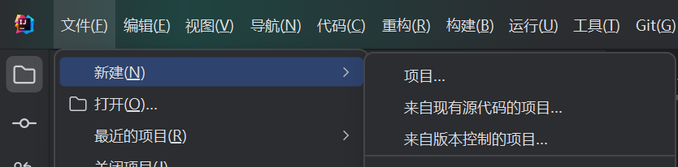
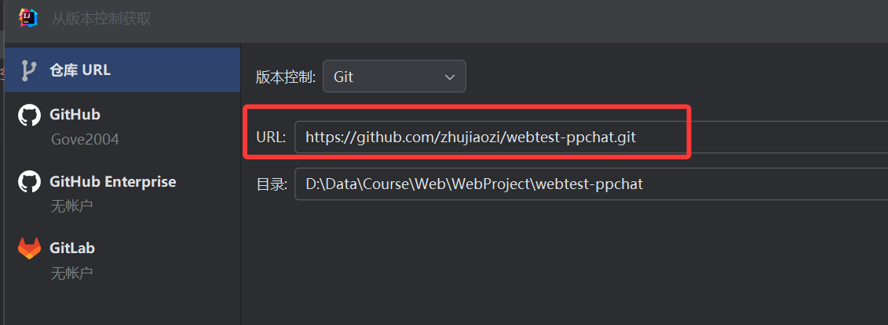

# 在线聊天系统（Web）

基于 JDK 21 的 Spring Boot + MySQL 的在线聊天系统

## 1. 版本要求

- **JDK**: 21 或更高版本
- **Maven**: 3.8 或更高版本
- **MySQL**: 8.0 或更高版本

## 2. 导入项目流程

### 步骤一：从版本控制系统克隆项目

在 IntelliJ IDEA 中创建新项目，选择从版本控制获取：

### 步骤二：填入 Git 链接

在弹出的对话框中填入项目的 Git 仓库链接：

### 步骤三：等待项目加载

IDEA 会自动识别 Maven 项目并下载依赖，等待右下角进度条完成即可。
