# 01-2025-2026-2-[占位符: 任课教师]-[占位符: 学生姓名]（[占位符: 学号]）-WEB程序设计-大作业报告

# 大作业报告

**课程名：** WEB程序设计  
**学院：** 信息工程学院  
**系：** 计算机科学与技术系  
**专业：** 计算机科学与技术  
**班级：** 计算机科学与技术 131班  
**姓名：** [占位符: 学生姓名]  
**项目名称：** PP Chat 在线聊天系统  
**任课教师：** [占位符: 任课教师]  
**授课学期：** [占位符: 授课学期]

**分数：** [占位符: 分数]

## 项目组编号

[占位符: 项目组编号]

## 项目名称

PP Chat 在线聊天系统

## 同组成员

- 陈弦
- 齐睿
- 沈越
- 宋佳伟
- 郭峰
- 李子旸

## 项目分工

1. 陈弦：账户系统（注册、登录、个人信息等）
2. 齐睿：好友系统（好友、好友分组、好友申请等）
3. 沈越：群聊系统（群聊、群主、公告等）
4. 宋佳伟：消息系统（私聊与群聊文本消息等）
5. 郭峰：语音模块（语音录制、发送与存储等）
6. 李子旸：后台管理系统（管理员后台、数据管理等）

# 《PP Chat 在线聊天系统》系统分析及设计报告

## 一、需求分析

本项目是《WEB程序设计》课程的大作业，选题方向为在线聊天系统。系统面向普通用户与管理员两类对象设计，目标是实现一个集用户认证、好友管理、群聊管理、实时消息、语音消息、通知中心和后台管理于一体的完整在线聊天平台。

### 1.1 系统用户分析

#### （1）普通用户
普通用户是系统的主要使用者，能够完成如下操作：

- 注册账号、登录系统、退出登录；
- 找回密码、修改昵称、头像和密码；
- 搜索其他用户并发送好友申请；
- 管理好友分组、备注、删除好友；
- 发起私聊并收发文本消息；
- 创建群聊、加入群聊、查看群公告和成员信息；
- 发送和接收语音消息；
- 搜索和导出聊天记录；
- 在通知中心中统一处理好友申请、群聊邀请和入群申请。

#### （2）管理员
管理员通过独立后台登录系统，主要承担系统数据维护职责，能够完成如下操作：

- 查看系统整体统计信息；
- 管理用户、好友关系、好友分组、好友申请；
- 管理私聊消息、群聊、群成员、群消息；
- 管理群邀请和入群申请；
- 重置用户密码；
- 删除无效或异常数据。

### 1.2 功能模块分析

根据系统需求，项目划分为以下六个核心模块：

#### （1）账户模块
- 用户注册
- 用户登录
- 忘记密码
- 退出登录
- 个人中心资料查看与修改

#### （2）好友模块
- 搜索用户
- 发送好友申请
- 处理好友申请
- 好友分组管理
- 移动好友分组
- 设置好友备注
- 删除好友

#### （3）群聊模块
- 创建群聊
- 查看群详情
- 邀请成员入群
- 申请加入群聊
- 审核入群申请
- 编辑群公告
- 成员退群与群主解散群聊

#### （4）消息模块
- 私聊文本消息
- 群聊文本消息
- 聊天记录搜索
- 聊天记录导出
- 未读消息统计
- WebSocket 实时消息推送

#### （5）语音模块
- 浏览器录音
- 语音消息发送
- 后端接收语音数据
- 文件落盘存储
- 聊天窗口播放语音消息

#### （6）后台管理模块
- 管理员登录
- 仪表盘统计
- 多类业务数据管理
- 搜索筛选
- 用户级联删除与密码重置

### 1.3 系统实现重点

为了使系统不仅满足课程大作业要求，而且具有较强的完整性与展示效果，项目实现过程中重点关注以下方面：

1. 账户模块的完整闭环；
2. 好友关系和群聊关系管理的清晰性；
3. 文本消息与语音消息的统一建模；
4. 通知中心对多种交互事件的统一处理；
5. 后台管理系统对数据维护的支撑能力；
6. 系统具备可部署、可演示、可维护的完整交付能力。

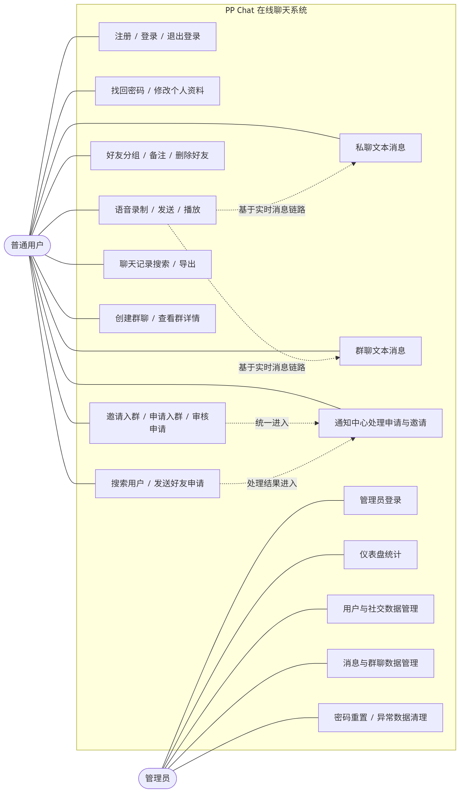

> 可将以上 Mermaid 图代码粘贴到支持 Mermaid 的编辑器中渲染后导出图片，再替换为正式插图。

---

## 二、数据库设计

本项目采用 MySQL 作为关系型数据库，围绕账户、好友、群聊、消息、语音、通知和后台管理等功能进行数据建模。数据库设计强调模块分工明确、消息结构统一、资源文件与结构化数据分离，并兼顾后续扩展性与查询效率。

### 2.1 核心数据表概览

| 表名 | 作用 |
|------|------|
| `pp_user` | 普通用户信息 |
| `pp_admin` | 管理员信息 |
| `pp_friend_group` | 好友分组 |
| `pp_friend` | 好友关系 |
| `pp_friend_request` | 好友申请 |
| `pp_private_message` | 私聊消息 |
| `pp_group_chat` | 群聊信息 |
| `pp_group_member` | 群成员关系 |
| `pp_group_message` | 群消息 |
| `pp_group_invitation` | 群邀请与入群申请 |

### 2.2 用户与管理员表设计

#### （1）用户表 `pp_user`

| 字段名 | 类型 | 说明 |
|--------|------|------|
| id | BIGINT | 用户 ID |
| username | VARCHAR | 登录用户名，唯一 |
| password | VARCHAR | BCrypt 加密密码 |
| nickname | VARCHAR | 昵称 |
| avatar | VARCHAR | 头像路径 |
| status | INT | 在线状态 |
| last_login | DATETIME | 最近登录时间 |
| login_count | INT | 登录次数 |

#### （2）管理员表 `pp_admin`

| 字段名 | 类型 | 说明 |
|--------|------|------|
| id | BIGINT | 管理员 ID |
| username | VARCHAR | 管理员账号 |
| password | VARCHAR | BCrypt 加密密码 |
| nickname | VARCHAR | 管理员昵称 |
| created_at | DATETIME | 创建时间 |

### 2.3 好友关系相关表设计

#### （1）好友分组表 `pp_friend_group`

| 字段名 | 类型 | 说明 |
|--------|------|------|
| id | BIGINT | 分组 ID |
| user_id | BIGINT | 所属用户 ID |
| name | VARCHAR | 分组名称 |
| sort_order | INT | 排序值 |

#### （2）好友关系表 `pp_friend`

| 字段名 | 类型 | 说明 |
|--------|------|------|
| id | BIGINT | 主键 |
| user_id | BIGINT | 当前用户 |
| friend_id | BIGINT | 对应好友 |
| group_id | BIGINT | 所属分组 |
| remark | VARCHAR | 备注名 |
| created_at | DATETIME | 创建时间 |

#### （3）好友申请表 `pp_friend_request`

| 字段名 | 类型 | 说明 |
|--------|------|------|
| id | BIGINT | 主键 |
| from_user_id | BIGINT | 申请发送者 |
| to_user_id | BIGINT | 申请接收者 |
| message | TEXT | 验证消息 |
| status | INT | 0待处理，1同意，2拒绝 |
| created_at | DATETIME | 申请时间 |

### 2.4 群聊相关表设计

#### （1）群聊表 `pp_group_chat`

| 字段名 | 类型 | 说明 |
|--------|------|------|
| id | BIGINT | 群聊 ID |
| name | VARCHAR | 群名称 |
| owner_id | BIGINT | 群主 ID |
| notice | TEXT | 群公告 |
| created_at | DATETIME | 创建时间 |

#### （2）群成员表 `pp_group_member`

| 字段名 | 类型 | 说明 |
|--------|------|------|
| id | BIGINT | 主键 |
| group_id | BIGINT | 所属群聊 |
| user_id | BIGINT | 成员 ID |
| role | INT | 0成员，1管理员，2群主 |
| joined_at | DATETIME | 入群时间 |

#### （3）群邀请表 `pp_group_invitation`

| 字段名 | 类型 | 说明 |
|--------|------|------|
| id | BIGINT | 主键 |
| group_id | BIGINT | 所属群聊 |
| from_user_id | BIGINT | 发起者 |
| to_user_id | BIGINT | 接收者 |
| type | INT | 0邀请，1申请 |
| status | INT | 0待处理，1接受，2拒绝 |
| created_at | DATETIME | 创建时间 |

### 2.5 消息相关表设计

#### （1）私聊消息表 `pp_private_message`

| 字段名 | 类型 | 说明 |
|--------|------|------|
| id | BIGINT | 主键 |
| sender_id | BIGINT | 发送者 ID |
| receiver_id | BIGINT | 接收者 ID |
| content | TEXT | 文本内容或语音说明文本 |
| msg_type | INT | 0文本，1语音 |
| audio_data | LONGTEXT | 语音文件 URL |
| status | INT | 0已发送，1已送达，2已读 |
| created_at | DATETIME | 创建时间 |

#### （2）群消息表 `pp_group_message`

| 字段名 | 类型 | 说明 |
|--------|------|------|
| id | BIGINT | 主键 |
| group_id | BIGINT | 所属群聊 |
| sender_id | BIGINT | 发送者 ID |
| content | TEXT | 文本内容或语音说明文本 |
| msg_type | INT | 0文本，1语音 |
| audio_data | LONGTEXT | 语音文件 URL |
| created_at | DATETIME | 创建时间 |

### 2.6 数据库设计总结

通过以上设计，系统能够较自然地支撑账户、好友、群聊、消息、通知和后台管理等多个模块。账户体系解决身份认证问题，好友体系解决社交关系维护问题，群聊体系解决多人沟通问题，消息体系统一处理文本与语音，管理员体系则为系统维护提供保障。这种设计体现了数据结构之间分工明确、协同工作的特点。

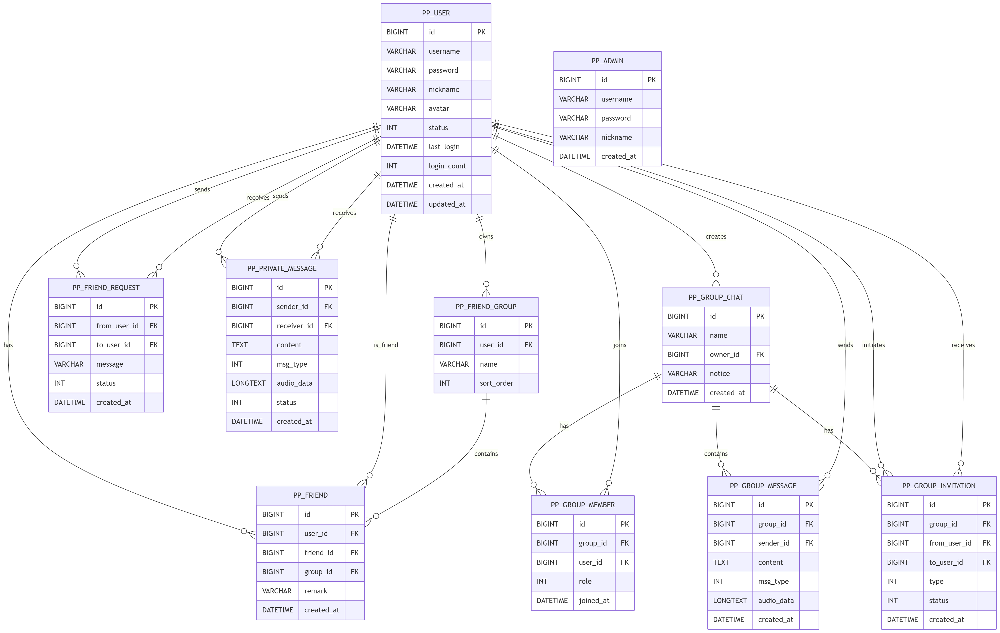

---

## 三、架构设计

项目整体采用 Spring Boot 单体架构，前后端并未完全分离，而是采用“Thymeleaf 页面 + 原生 JavaScript SPA + WebSocket STOMP”混合模式。这样设计的目的是在保证开发效率的同时，兼顾聊天系统对实时交互的要求。

### 3.1 整体架构

系统整体可以分为四层：

1. **浏览器端**：负责页面展示、用户交互、消息渲染、录音播放等；
2. **Spring Boot 服务端**：负责页面路由、REST API、WebSocket 消息处理与业务逻辑；
3. **MySQL 数据库**：负责持久化用户、好友、群聊、消息、通知和后台管理等业务数据；
4. **文件系统**：负责头像、语音等资源文件存储。

### 3.2 后端分层设计

#### （1）Controller 层
- `controller/page`：负责页面跳转与 Thymeleaf 渲染；
- `controller/rest`：负责 JSON 接口返回；
- `controller/websocket`：负责 STOMP 消息接收与转发。

#### （2）Service 层
- `UserService`：注册、登录、密码修改、级联删除；
- `FriendService`：好友关系、分组、申请；
- `ChatService`：私聊消息保存、查询、导出；
- `GroupService`：群聊、成员、邀请、申请；
- `AdminService`：管理员登录与初始化；
- `FileService`：头像与语音文件保存。

#### （3）Repository 层
Repository 层基于 Spring Data JPA，实现对数据库表的增删改查，并通过自定义查询支持未读统计、搜索和批量加载等需求。

### 3.3 前端模块划分

前端聊天主界面采用模块化 JavaScript 文件组织，主要包括：

- `chat-core.js`：全局状态、初始化、WebSocket 连接、视图切换；
- `chat-view.js`：会话列表、聊天窗口、消息渲染、语音录制、搜索与导出；
- `chat-friends.js`：好友列表、好友申请、通知中心；
- `chat-groups.js`：群聊列表、群详情、创建群、邀请与申请；
- `chat-profile.js`：个人中心；
- `chat-ui.js`：模态框、抽屉、粒子背景、分割线等 UI 交互；
- `theme.js`：主题切换。

### 3.4 实时通信架构

系统聊天功能基于 WebSocket STOMP 实现：

- 私聊消息发送到 `/app/chat/private`，接收订阅 `/user/queue/private`；
- 群聊消息发送到 `/app/chat/group`，接收订阅 `/topic/group/{groupId}`；
- 文本消息与语音消息共用同一条实时消息链路；
- 握手阶段通过 Session 验证用户身份，并将 Principal 设置为用户 ID。

### 3.5 架构设计总结

本项目在架构上强调“统一”和“协作”：前端统一走模块化 JS，后端统一走 Controller-Service-Repository 分层，消息统一走 WebSocket STOMP，文件统一走文件系统与数据库分离存储。这种架构既适合作为课程项目开发，也便于多人协作、联调和后期部署。

---

## 四、功能实现（完整代码见光盘）

### 4.1 系统主要功能实现概述

本项目围绕六个模块展开实现，整体完成情况如下：

1. **账户模块**：完成注册、登录、忘记密码和个人中心资料修改；
2. **好友模块**：完成搜索、申请、分组、备注、删除与通知处理；
3. **群聊模块**：完成群创建、公告、成员管理、邀请入群与申请入群；
4. **消息模块**：完成私聊/群聊文本消息实时收发、未读统计、聊天记录搜索与导出；
5. **语音模块**：完成录音、发送、存储、播放，并融入统一消息链路；
6. **后台管理模块**：完成管理员登录、仪表盘、数据 CRUD、搜索与用户级联删除。

### 4.2 各模块实现说明

#### （1）账户模块
通过 `UserService` 实现注册校验、密码加密、登录验证和密码修改。系统使用 Session 保存当前登录用户状态，并在个人中心中展示头像、昵称、登录次数和最近登录时间等信息。

#### （2）好友模块
通过 `FriendService` 实现好友搜索、好友申请、分组管理、备注设置和好友删除。项目采用双向好友关系存储方案，使双方都可以独立维护自己的好友列表。

#### （3）群聊模块
通过 `GroupService` 实现群聊创建、群成员关系管理、群公告、邀请入群和申请入群。系统在群邀请表中通过 `type` 区分“邀请”和“申请”，使通知处理更统一。

#### （4）消息模块
通过 `ChatService` 和 `ChatController` 实现私聊与群聊消息的收发、持久化、搜索、导出和未读统计功能。其中私聊采用点对点推送，群聊采用广播推送。

#### （5）语音模块
语音模块是在消息模块基础上的扩展。用户可在聊天窗口中直接录音，前端将音频转换为 Base64 后通过 STOMP 发送，后端将其保存为文件并在数据库中记录 URL，从而实现私聊和群聊中的语音消息功能。

#### （6）后台管理模块
后台管理模块通过 `AdminRestController` 和 `AdminService` 提供独立管理员登录、仪表盘统计、多表数据管理、搜索筛选、密码重置和用户级联删除等功能。

### 4.3 代表性核心业务代码

以下以语音消息功能为代表，展示项目中较完整的一条功能实现链路。该部分代码总行数已超过模板要求中“纸质版不少于 200 行”的标准，能够充分体现项目在前端交互、实时通信、后端处理和文件存储方面的综合实现。

#### （1）前端录音与发送核心代码

```javascript
function initVoiceBtn() {
    const btn = document.getElementById('imVoiceBtn');
    if (!btn || btn.dataset.bound) return;
    btn.dataset.bound = 'true';

    let recorder, chunks = [], recording = false, countdownTimer = null, secondsLeft = 0, startTime = 0;
    const MAX_SECONDS = 10;

    const stopRecording = () => {
        if (recorder && recording) recorder.stop();
    };

    btn.onclick = async () => {
        if (recording) {
            stopRecording();
            return;
        }

        const stream = await navigator.mediaDevices.getUserMedia({ audio: true });
        recorder = new MediaRecorder(stream, { mimeType: 'audio/webm;codecs=opus' });
        chunks = [];
        recording = true;
        startTime = Date.now();
        secondsLeft = MAX_SECONDS;

        recorder.ondataavailable = e => {
            if (e.data && e.data.size > 0) chunks.push(e.data);
        };

        recorder.onstop = () => {
            recording = false;
            clearInterval(countdownTimer);

            const durationSec = Math.round((Date.now() - startTime) / 1000);
            if (durationSec < 1 || !chunks.length) return;

            const blob = new Blob(chunks, { type: 'audio/webm' });
            const reader = new FileReader();
            reader.onloadend = () => {
                const base64 = reader.result;
                stompClient.send(currentChat.isGroup ? '/app/chat/group' : '/app/chat/private', {}, JSON.stringify({
                    senderId: userId,
                    receiverId: currentChat.isGroup ? null : currentChat.id,
                    receiver: currentChat.isGroup ? String(currentChat.id) : null,
                    content: `[语音] ${durationSec}s`,
                    msgType: 1,
                    audioData: base64
                }));
            };
            reader.readAsDataURL(blob);
            stream.getTracks().forEach(track => track.stop());
        };

        recorder.start();
        countdownTimer = setInterval(() => {
            secondsLeft--;
            if (secondsLeft <= 0) stopRecording();
        }, 1000);
    };
}
```

#### （2）后端接收与文件保存核心代码

```java
@MessageMapping("/chat/private")
public void sendPrivateMessage(@Payload ChatMessage message, Principal principal) {
    if (!isActiveSender(message.getSenderId(), principal)
            || message.getReceiverId() == null
            || !userRepository.existsById(message.getReceiverId())) {
        return;
    }

    message.setTime(LocalDateTime.now());
    message.setStatus(0);

    String audioUrl = null;
    if (message.getMsgType() != null && message.getMsgType() == 1 && message.getAudioData() != null) {
        try {
            audioUrl = fileService.saveBase64Audio(message.getAudioData());
        } catch (Exception e) {
            audioUrl = null;
        }
        message.setAudioData(audioUrl);
    }

    PrivateMessage saved = chatService.savePrivateMessage(
            message.getSenderId(), message.getReceiverId(),
            message.getContent(), message.getMsgType(), audioUrl);
    message.setId(saved.getId());

    User sender = userRepository.findById(message.getSenderId()).orElse(null);
    if (sender != null) {
        message.setSender(sender.getDisplayName());
    }

    messagingTemplate.convertAndSendToUser(
            message.getReceiverId().toString(), "/queue/private", message);
}

public String saveBase64Audio(String base64Data) throws IOException {
    String[] parts = base64Data.split(",");
    String header = parts[0];
    String data = parts.length > 1 ? parts[1] : parts[0];

    String mimeType = "audio/webm";
    if (header.contains(":") && header.contains(";")) {
        mimeType = header.substring(header.indexOf(":") + 1, header.indexOf(";"));
    }

    String extension = switch (mimeType) {
        case "audio/webm" -> ".webm";
        case "audio/ogg" -> ".ogg";
        case "audio/wav" -> ".wav";
        case "audio/mp4" -> ".m4a";
        case "audio/mpeg" -> ".mp3";
        default -> ".webm";
    };

    byte[] audioBytes = Base64.getDecoder().decode(data);
    if (audioBytes.length > MAX_FILE_SIZE) {
        throw new IOException("音频文件大小超过限制（10MB）");
    }

    Path projectRoot = Paths.get(System.getProperty("user.dir")).toAbsolutePath();
    Path dir = projectRoot.resolve(uploadDir).resolve("audio");
    if (!Files.exists(dir)) Files.createDirectories(dir);

    String filename = UUID.randomUUID() + extension;
    Path filepath = dir.resolve(filename);
    Files.write(filepath, audioBytes);
    return "/uploads/audio/" + filename;
}
```

### 4.4 功能实现总结

从整体实现效果来看，本项目已经完成了课程要求的主要功能，并在此基础上增加了语音消息、通知中心、后台管理和线上部署等扩展能力，使项目形成了一个结构较完整、交互较流畅、可展示可部署的在线聊天系统。

---

## 五、界面成果展示

### 5.1 聊天主界面

聊天主界面采用三栏布局：左侧为导航栏，中间为会话/好友/群聊/通知列表，右侧为聊天内容区或详情区。整体界面风格参考即时通讯软件桌面端布局，强调操作直观与信息分区清晰。

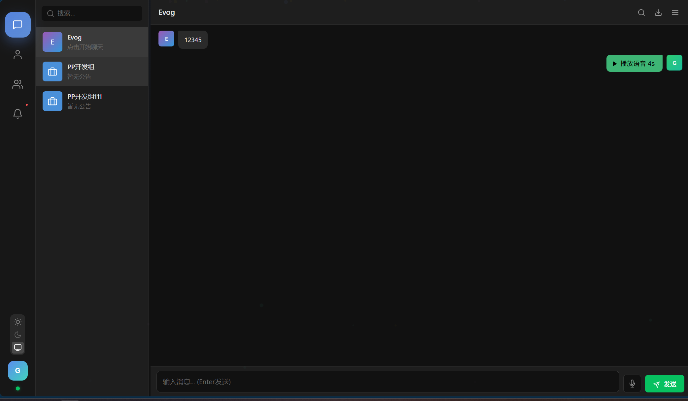  
  
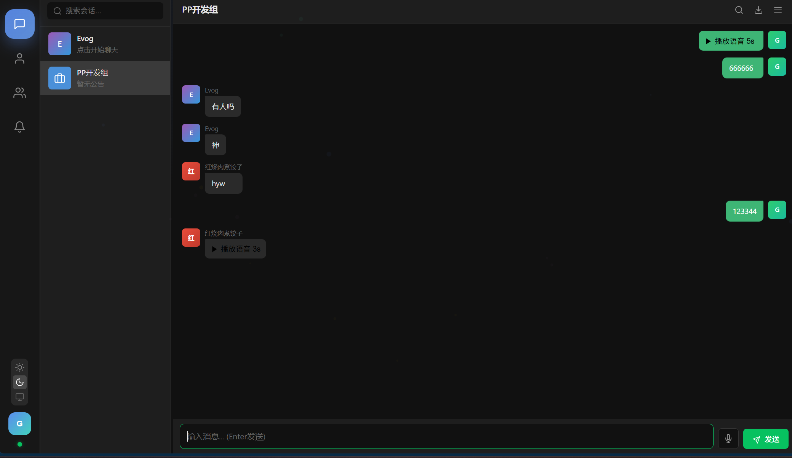  
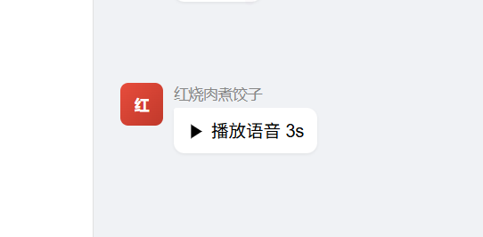

### 5.2 好友与群聊界面

系统在好友与群聊视图中提供了较完整的管理能力，包括好友分组展示、好友详情展示、群详情展示以及成员与公告管理等内容。

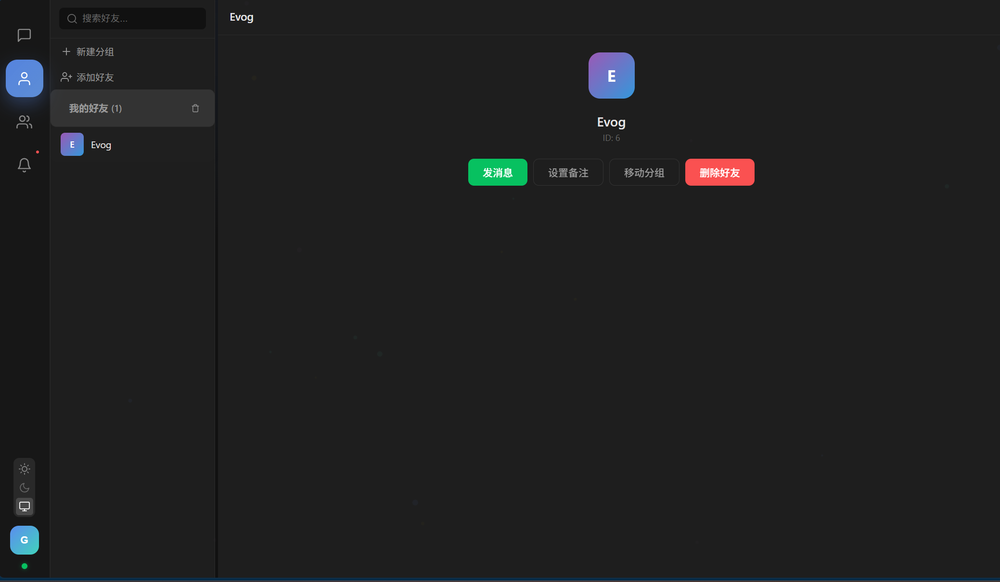  
  
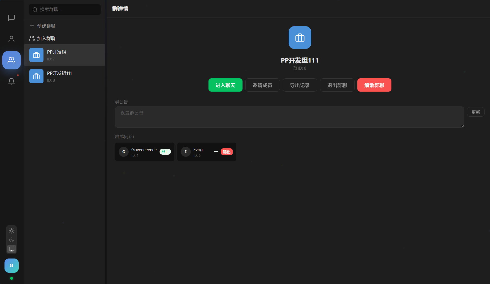  


### 5.3 通知中心与后台管理界面

系统将好友申请、群聊邀请和入群申请统一整合在通知中心中，同时实现了后台管理系统，用于展示和维护系统数据。

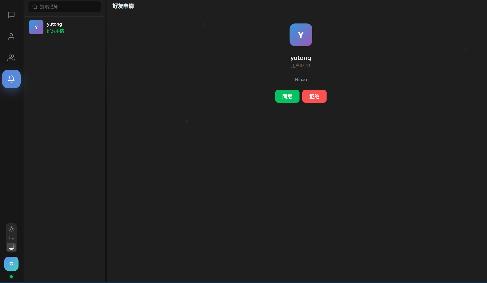  
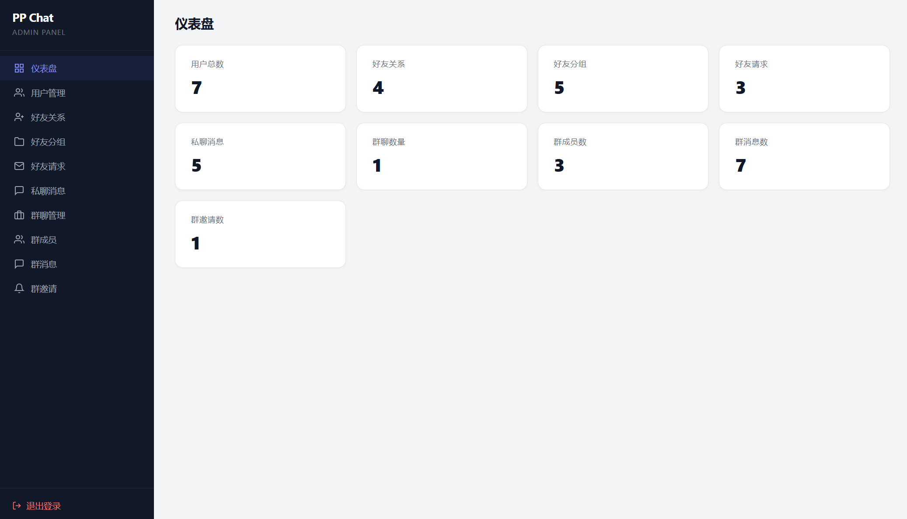  
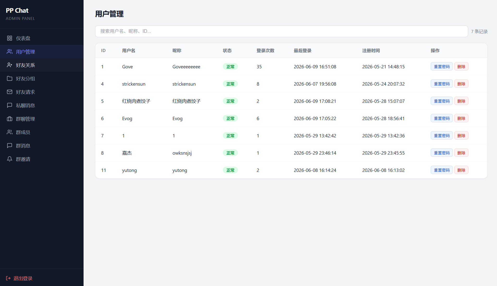

### 5.4 部署成果展示

项目已成功部署到云服务器，并通过域名和 HTTPS 提供访问能力。

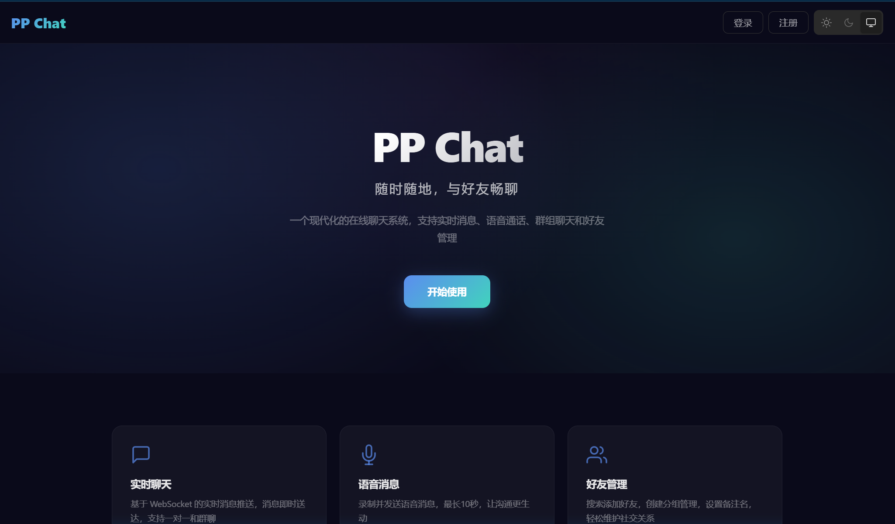  


---

## 六、心得体会

[占位符: 从 reports/self/心得.md 中选择对应分工的心得粘贴到此处]
